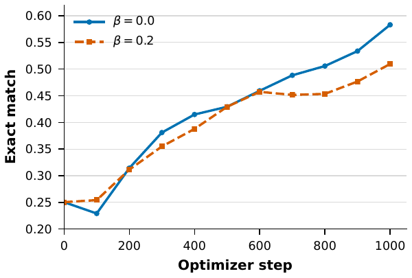
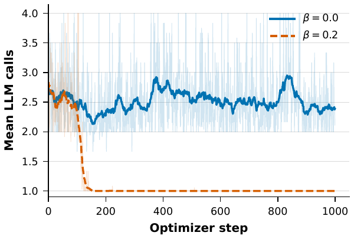

# Learning Agentic Workflows for text2sql with Reinforcement Learning

📢 2026년 여름학기 [AIKU](https://github.com/AIKU-Official) 활동으로 진행한 프로젝트입니다.

## 소개

자연어 질의를 SQL로 옮기는 Text-to-SQL task는 자연어처리(NLP, Natural Language Processing) 분야에서 이미 오랫동안 연구되어 온 task이지만, 복잡한 자연어 질의를 작은 언어 모델(SLM, Small Language Model)이 정확하게 SQL로 옮기는 데에는 여전히 한계가 있습니다.
따라서 본 프로젝트에서는 SLM의 Text-to-SQL task 성능을 향상시키기 위해 Agent 구조를 설계하고, 이를 RL 기반 finetuning 하여 baseline 대비 task 성능을 향상시키는 것을 목표로 합니다.
이 프로젝트의 핵심 키워드는 다음과 같습니다.
- Agentic AI
- Text-to-SQL
- Reinforcement Learning

## 방법론

이 프로젝트에서 제안하는 핵심 방법론은 크게 두 가지 축으로 정리할 수 있습니다: (1) Agentic workflow 기반 SQL 생성 (2) Reinforcement Learning 기반 generalization 성능 향상.

### 1. Agentic workflow

복잡한 자연어 질의와 database schema를 이해한 다음, 이를 실행 가능한 SQL query로 한 번에 정확하게 변환하는 task는 SLM에게는 여전히 어려운 과제입니다. [[Overall Performance](#2-overall-performance)]
이를 개선하기 위해 본 프로젝트에서는 자연어 질의를 단계적으로 SQL로 변환하는 Agentic workflow를 설계합니다.
각 iteration에서 LLM agent는 현재 context만으로 정답 SQL을 생성할 수 있다고 확신하는지 판단하고, 다음 두 가지 action 중 하나를 선택합니다.
- `<Answer>`: Agent가 정답 SQL을 생성할 수 있다고 판단하면 최종 SQL query를 출력합니다. 이후 iteration을 종료하고, 생성된 query를 기준으로 정답 여부를 평가합니다.
- `<Intermediate>`: Agent가 정답 SQL을 생성할 수 있다고 확신하지 못하면 Intermediate query를 출력합니다. 이는 정답 query의 subquery이거나 문법 오류를 확인하기 위한 query일 수 있습니다. Intermediate query는 SQLite 환경에서 실행되며, 실행 결과는 다음 iteration의 context에 추가됩니다.

이를 수학적으로 아래와 같이 나타낼 수 있습니다.
Trajectory의 초기 상태 $s_0$는 사용자의 자연어 질의 $q$와 database schema $\mathcal{S}$로 구성됩니다.
$$s_0=\langle q, \mathcal{S} \rangle.$$

$t$번째 상태 $s_t$에서 policy $\pi_\theta$를 통해 action $a_t$를 샘플링합니다.
$$a_t\sim \pi_\theta(\cdot\mid s_t) \qquad \text{where }a_t\in\{\texttt{Answer}(y_t), \texttt{Intermediate}(z_t)\}$$

이때 $y_t$와 $z_t$는 각각 실행 가능한 SQL query를 의미합니다.
- $a_t=\texttt{Answer}(y_t)$이면 $y_t$가 최종 SQL query가 되면서 interation이 종료됩니다.
- $a_t=\texttt{Intermediate}(z_t)$이면 $z_t$를 실행한 다음 iteration의 state $s_{t+1}$을 다음과 같이 업데이트합니다. 
$$s_{t+1}\leftarrow s_t\oplus z_t \oplus e_t \qquad \text{where }e_t \text{ is the execution result of the query }z_t.$$

Iteration을 통해 최종 trajectory $\tau$는 다음과 같이 구성됩니다.
$$\tau = (s_0, a_0, o_0, s_1, a_1, o_1,\cdots s_T, a_T) \qquad \text{where }a_T=\texttt{Answer}(y_T).$$

### 2. GRPO based Reinforcement Learning

## 실험 결과

### 1. Experimental Setup

### 2. Overall Performance

Baseline과 proposed method의 전체 성능은 아래 표와 같습니다.

| Method | Execution Accuracy | Exact Match | Mean LLM Calls | Non Executable Ratio |
| --- | ---: | ---: | ---: | ---: |
| Single-turn zero-shot | 0.556 | 0.264 | 1.0 | 0.127 |
| Multi-turn zero-shot | 0.537 | 0.256 | 2.490 | 0.088 |
| Single-turn SFT | 0.646 | 0.558 | 1.0 | 0.132 |
| Multi-turn SFT | 0.636 | 0.544 | 1.0 | 0.141 |
| Single-turn RL | 0.532 | 0.415 | 1.0 | 0.227 |
| **Multi-turn RL (Ours)** | **0.653** | **0.575** | 2.270 |**0.056** |

표의 결과를 통해 다음과 같은 사실을 확인할 수 있습니다.

- RL fine-tuning은 zero-shot 및 SFT보다 높은 일반화 성능을 보이며, 정확도와 실행 불가능 비율 모두에서 개선된 결과를 나타냅니다.
- RL을 통해 LLM은 최종 답변과 Intermediate query를 출력할 시점을 판단하는 방법을 학습합니다.
    - Multi-turn 방식의 평균 LLM 호출 횟수가 zero-shot의 2.490회에서 RL fine-tuning 후 2.270회로 감소하여 효율성이 향상되었습니다.
    - Multi-turn 적용에 따른 성능 향상은 RL fine-tuning에서만 관찰되었으며, zero-shot과 SFT에서는 오히려 성능이 저하되었습니다.

### 3. Hyperparameter Analysis

Intermediate query 생성에 부과되는 보상 페널티의 강도를 조절하는 하이퍼파라미터 $\beta$를 달리하여 학습한 결과는 다음과 같습니다.

<table>
  <tr>
    <td align="center">
      
    </td>
    <td align="center">
      
    </td>
  </tr>
</table>

그래프에서 확인할 수 있는 주요 결과는 다음과 같습니다.

- $\beta=0.0$으로 설정했을 때 전반적으로 더 높은 성능을 보입니다.
- $\beta=0.0$에서는 Intermediate query 수의 변동 폭이 크게 나타납니다. 이는 Intermediate query가 필요하지 않은 상황을 충분히 학습하지 못했음을 시사합니다.
- $\beta=0.2$에서는 학습 초기부터 Intermediate query 수가 빠르게 0으로 수렴합니다. 이는 GRPO 학습 과정에서 Intermediate query의 필요성이 과도하게 낮게 평가되는 경향이 있음을 보여줍니다.

### 4. Case Studies

## Contribution 및 takeaway

## 사용 방법

### 1. Repository 구조 설명

### 2. 프로젝트 의존성 설명

### 3. Baseline 및 방법론 실행
